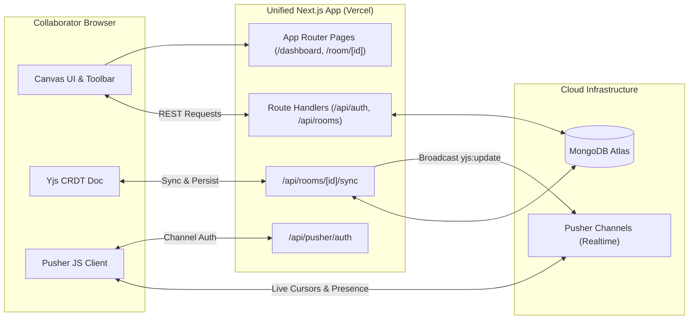

<div align="center">

# 🎨 MergeCanvas

**A pure Next.js real-time collaborative whiteboard for teams**

Draw, sketch, and brainstorm together — live cursors, CRDT-based sync, and persistent rooms. Built as a unified full-stack Next.js app ready to deploy directly to Vercel.

[](#license)
[](#tech-stack)
[](#tech-stack)
[](#tech-stack)
[](#tech-stack)

[**Live App on Vercel**](https://merge-canvas.vercel.app/) · [Report a Bug](https://github.com/Sumit-y88/Merge-canvas/issues) · [Request a Feature](https://github.com/Sumit-y88/Merge-canvas/issues)

</div>

---

## Table of Contents

- [Overview](#overview)
- [Features](#features)
- [Tech Stack](#tech-stack)
- [Architecture](#architecture)
- [Project Structure](#project-structure)
- [Getting Started](#getting-started)
  - [Prerequisites](#prerequisites)
  - [Local Setup](#local-setup)
  - [Environment Variables](#environment-variables)
- [Deploying to Vercel](#deploying-to-vercel)
- [API Route Handlers](#api-route-handlers)
- [Realtime Collaboration (Pusher)](#realtime-collaboration-pusher)
- [License](#license)

---

## Overview

**MergeCanvas** is a full-stack, real-time collaborative whiteboard application built entirely with **Next.js App Router**. It unifies the React frontend and serverless API route handlers into a single codebase, configured with a single `.env` file for effortless 1-click deployment on **Vercel**.

Canvas state is modeled as a **Yjs CRDT document**, synced in real-time over **Pusher Channels** (using Presence Channels for live cursors and shape updates), and durably persisted to **MongoDB**. Authentication supports email/password and **Google Sign-In**, with short-lived JWT access tokens and rotating refresh tokens stored in HTTP-only cookies.

---

## Features

- 🖊️ **Drawing tools** — select, freehand pen, rectangle, ellipse, line, arrow, text, sticky notes, and eraser, each with dedicated keyboard shortcuts
- 🎨 **Style controls** — stroke/fill color, stroke width, sticky-note color palette, and snap-to-grid
- 🧩 **Ready-made templates** for quickly starting a board
- 👥 **Live multiplayer** — real-time cursors, presence (`join`/`leave`) events, and conflict-free concurrent edits via Yjs CRDTs + Pusher
- 🔐 **Authentication** — email/password signup & login, Google OAuth sign-in, JWT access tokens + rotating refresh tokens
- 🏠 **Rooms & permissions** — create/join rooms via invite codes, `owner` / `editor` / `viewer` roles, public or private rooms, and per-collaborator role management
- 💾 **Persistence** — canvas snapshots and Yjs binary CRDT state saved to MongoDB, restored automatically
- 🖼️ **Export** — download the board as an image
- 🌓 **Light/Dark theme** toggle
- 📊 **Undo / redo**, zoom, and a full canvas history stack

---

## Tech Stack

- **Framework**: [Next.js App Router](https://nextjs.org/) + [React 19](https://react.dev/)
- **Database**: [MongoDB](https://www.mongodb.com/) via [Mongoose](https://mongoosejs.com/) (serverless-optimized connection caching)
- **CRDT Sync**: [Yjs](https://docs.yjs.dev/) for conflict-free concurrent editing
- **Realtime**: [Pusher](https://pusher.com/channels) (`pusher` server SDK + `pusher-js` client SDK)
- **Styling**: [Tailwind CSS](https://tailwindcss.com/)
- **Auth**: [JWT](https://github.com/auth0/node-jsonwebtoken), [bcryptjs](https://github.com/dcodeIO/bcrypt.js), and [Google Auth Library](https://github.com/googleapis/google-auth-library-nodejs)
- **Icons**: [Lucide React](https://lucide.dev/)

---

## Architecture



---

## Project Structure

```
Merge-canvas/
├── app/                         # Next.js App Router
│   ├── api/                     # Serverless Route Handlers
│   │   ├── auth/                # /api/auth (signup, login, google, refresh, logout, profile)
│   │   ├── rooms/               # /api/rooms (CRUD, join, canvas, sync, collaborators)
│   │   └── pusher/auth/         # /api/pusher/auth (Presence channel auth)
│   ├── dashboard/               # User dashboard screen
│   ├── room/[id]/               # Whiteboard canvas room screen
│   ├── login/                   # Login screen
│   ├── signup/                  # Signup screen
│   ├── profile/                 # Profile screen
│   ├── layout.tsx               # Root layout
│   └── page.tsx                 # Landing page
├── src/
│   ├── api/                     # Frontend Axios client + Pusher client (.ts)
│   ├── components/              # Canvas, Toolbar, Modals, UI primitives (.tsx)
│   ├── context/                 # AuthContext & ThemeContext (.tsx)
│   ├── hooks/                   # Custom React hooks (.ts)
│   ├── lib/                     # Canvas geometry, Yjs bridge, db connection, pusherServer (.ts)
│   ├── models/                  # Mongoose models (.ts)
│   ├── services/                # Business logic services (.ts)
│   └── utils/                   # Token utils, payload validation (.ts)
├── public/                      # Static assets
├── .env.example                 # Unified environment variable template
├── tsconfig.json                # TypeScript configuration
├── next.config.mjs              # Next.js configuration
├── tailwind.config.js           # Tailwind CSS configuration
└── package.json                 # Single package configuration
```

---

## Getting Started

### Prerequisites

- **Node.js 20+**
- **MongoDB** (local or [MongoDB Atlas](https://www.mongodb.com/cloud/atlas))
- **Pusher Channels Account** (free tier at [pusher.com](https://pusher.com/channels))

### Local Setup

```bash
# 1. Clone the repository
git clone https://github.com/Sumit-y88/Merge-canvas.git
cd Merge-canvas

# 2. Configure environment variables
cp .env.example .env
# Edit .env with your MongoDB URI, JWT secret, and Pusher credentials

# 3. Install dependencies
npm install

# 4. Start the unified development server
npm run dev
```

Open **http://localhost:3000** in your browser.

---

## Environment Variables

Configure these in your single `.env` file (and in Vercel Project Settings):

| Variable | Description |
|---|---|
| `MONGODB_URI` | MongoDB connection string (e.g. MongoDB Atlas cluster) |
| `JWT_SECRET` | Strong secret key for signing JWTs |
| `ACCESS_TOKEN_EXPIRES_IN` | Access token lifetime (default: `15m`) |
| `REFRESH_TOKEN_DAYS` | Refresh token lifetime in days (default: `7`) |
| `GOOGLE_CLIENT_ID` | Google OAuth Client ID (optional, for Google Sign-In) |
| `NEXT_PUBLIC_GOOGLE_CLIENT_ID` | Google OAuth Client ID for frontend button |
| `NEXT_PUBLIC_PUSHER_KEY` | Pusher app key from Pusher dashboard |
| `NEXT_PUBLIC_PUSHER_CLUSTER` | Pusher cluster (e.g. `mt1`, `ap2`, `eu`) |
| `PUSHER_APP_ID` | Pusher App ID |
| `PUSHER_SECRET` | Pusher App Secret |

> **Pusher Setup Tip**: In your Pusher dashboard, open **App Settings** and enable **Client Events** so collaborators can broadcast cursor movements and preview drafts with ultra-low latency directly between peers.

---

## Deploying to Vercel

1. Push your repository to GitHub.
2. In [Vercel](https://vercel.com/), click **New Project** and import the `Merge-canvas` repository.
3. Framework Preset will automatically detect **Next.js**. Leave root directory as `./`.
4. In **Environment Variables**, copy the variables from your `.env` file (`MONGODB_URI`, `JWT_SECRET`, `NEXT_PUBLIC_PUSHER_KEY`, `PUSHER_SECRET`, etc.).
5. Click **Deploy**. Your app is live!

---

## API Route Handlers

All endpoints run as serverless functions under `/api`:

* **Authentication**:
  * `POST /api/auth/signup` — Create account
  * `POST /api/auth/login` — Sign in with email & password
  * `POST /api/auth/google` — Sign in with Google credential
  * `POST /api/auth/refresh` — Refresh access token via HTTP-only cookie
  * `POST /api/auth/logout` — Revoke session and blacklist token
  * `GET, PATCH /api/auth/profile` — View and edit profile
  * `PATCH /api/auth/profile/password` — Change password
* **Rooms & Canvas**:
  * `GET, POST /api/rooms` — List rooms or create a room
  * `POST /api/rooms/join` — Join room by invite code
  * `GET, PATCH, DELETE /api/rooms/[id]` — View, configure, or delete room
  * `PUT /api/rooms/[id]/canvas` — Persist canvas snapshot
  * `GET, POST /api/rooms/[id]/sync` — CRDT state synchronization & broadcast
  * `POST /api/rooms/[id]/events` — Broadcast room events
  * `POST /api/rooms/[id]/leave` — Leave a room
  * `POST /api/rooms/[id]/invite/regenerate` — Regenerate room invite code
  * `PATCH, DELETE /api/rooms/[id]/collaborators/[userId]` — Manage member roles & remove members
* **Realtime Authorization**:
  * `POST /api/pusher/auth` — Authenticate access to presence channels (`presence-room-[id]`)

---

## License

ISC License.
